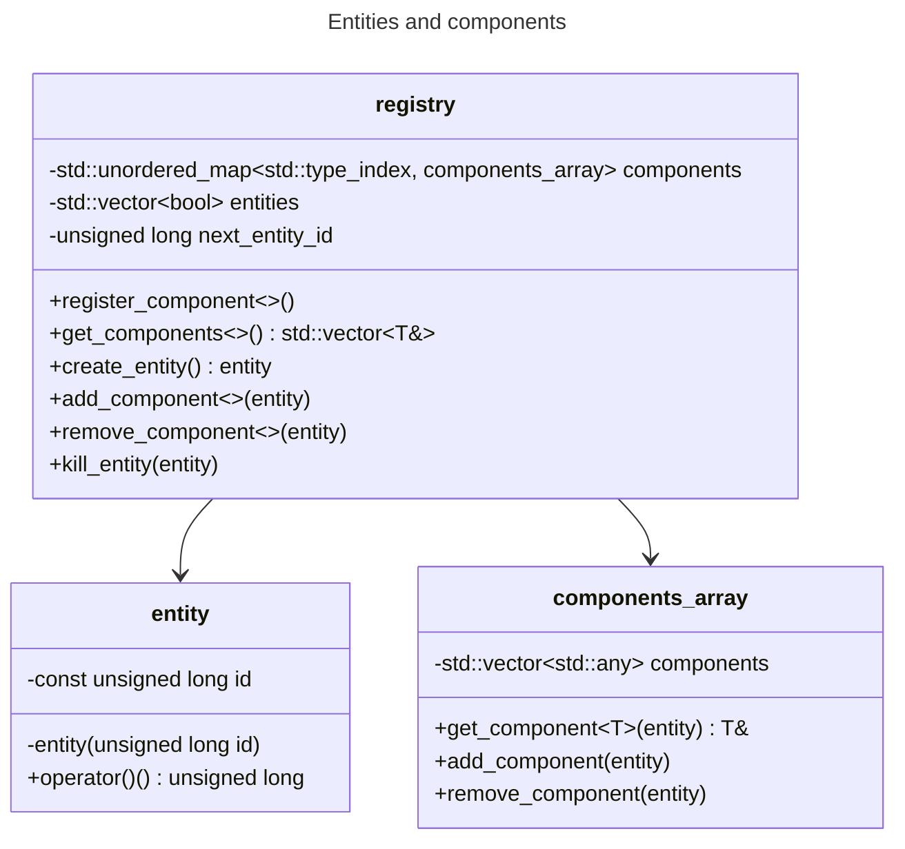
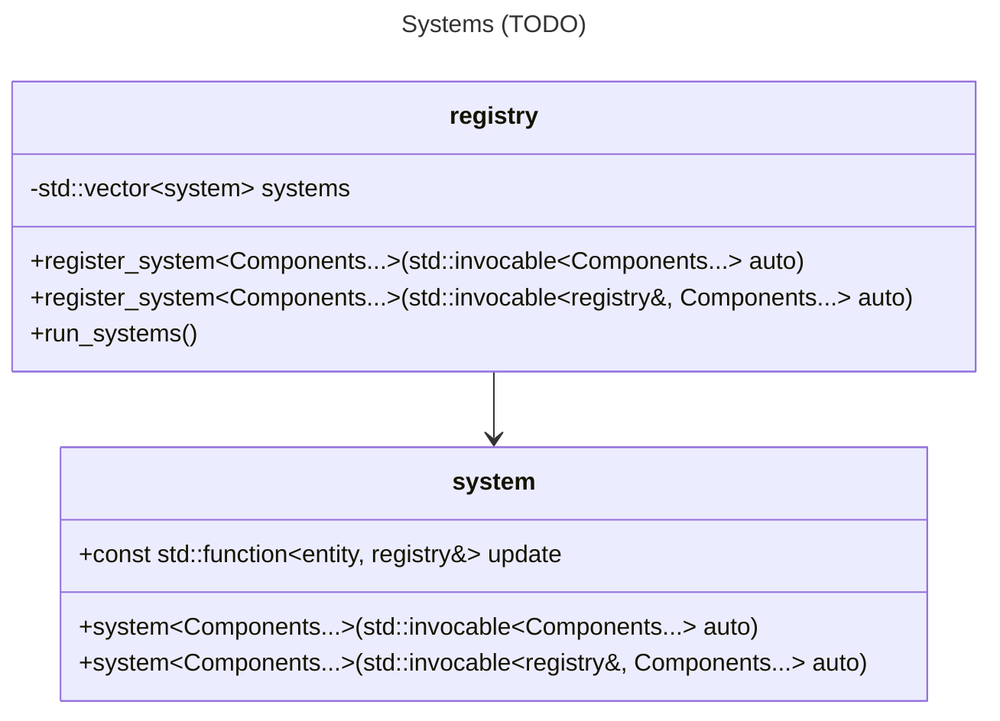
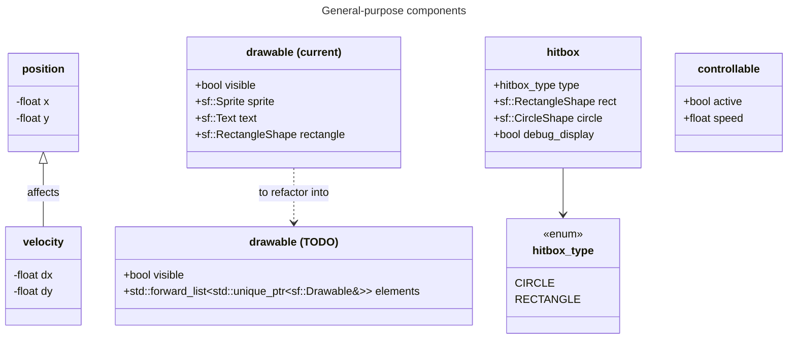

# ECS diagrams

## ECS Architecture

```mermaid
---
title: Entities and components
---
classDiagram
    registry --> entity
    registry --> components_array
    class registry {
        -std::unordered_map~std::type_index, components_array~ components
        -std::vector~bool~ entities
        -unsigned long next_entity_id
        +register_component<>()
        +get_components<>() std::vector~T&~
        +create_entity() entity
        +add_component<>(entity)
        +remove_component<>(entity)
        +kill_entity(entity)
    }
    class entity {
        -const unsigned long id
        -entity(unsigned long id)
        +operator()() unsigned long
    }
    class components_array {
        -std::vector~std::any~ components
        +get_component~T~(entity) T&
        +add_component(entity)
        +remove_component(entity)
    }
```

```mermaid
---
title: Systems (TODO)
---
classDiagram
    registry --> system
    class registry {
        -std::vector~system~ systems
        +register_system~Components...~(std::invocable~Components...~ auto)
        +register_system~Components...~(std::invocable~registry&, Components...~ auto)
        +run_systems()
    }
    class system {
        +const std::function~entity, registry&~ update
        +system~Components...~(std::invocable~Components...~ auto)
        +system~Components...~(std::invocable~registry&, Components...~ auto)
    }
```

## ECS components

```mermaid
---
title: General-purpose components
---
classDiagram
    position <|-- velocity : affects
    class position {
        -float x
        -float y
    }
    class velocity {
        -float dx
        -float dy
    }
    class drawable["drawable (TODO)"] {
        +bool visible
        +std::forward_list~std::unique_ptr~sf::Drawable&~~ elements
    }
    class drawable_old["drawable (current)"] {
        +bool visible
        +sf::Sprite sprite
        +sf::Text text
        +sf::RectangleShape rectangle
    }
    drawable_old ..> drawable : to refactor into
    class hitbox_type {
        CIRCLE
        RECTANGLE
    }
    <<enum>> hitbox_type
    hitbox --> hitbox_type
    class hitbox {
        +hitbox_type type
        +sf::RectangleShape rect
        +sf::CircleShape circle
        +bool debug_display
    }
    class controllable {
        +bool active
        +float speed
    }
```
