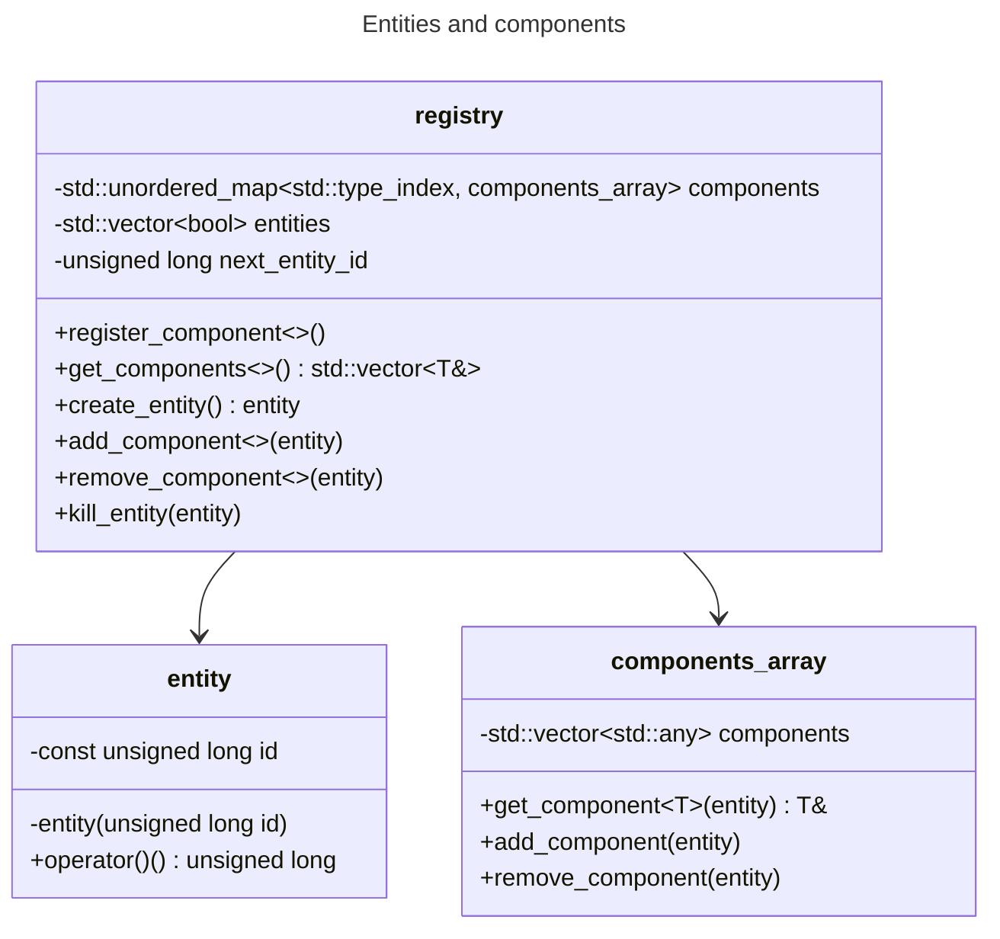
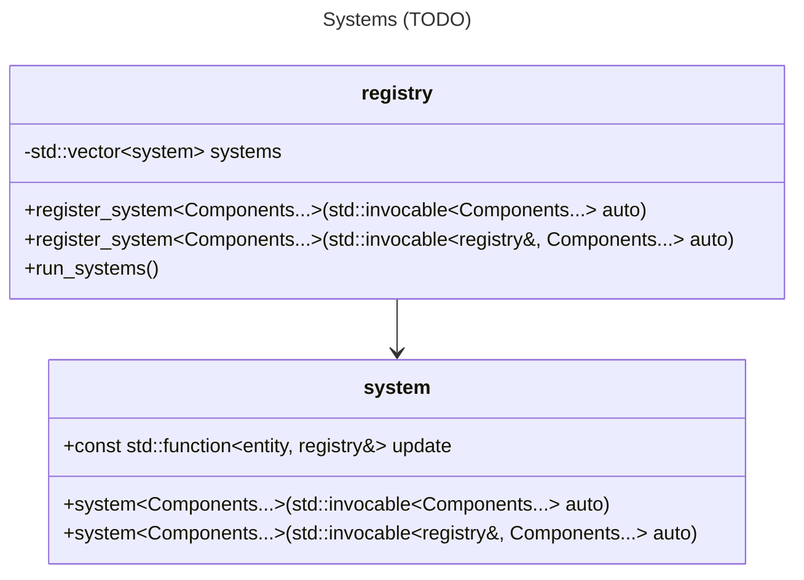
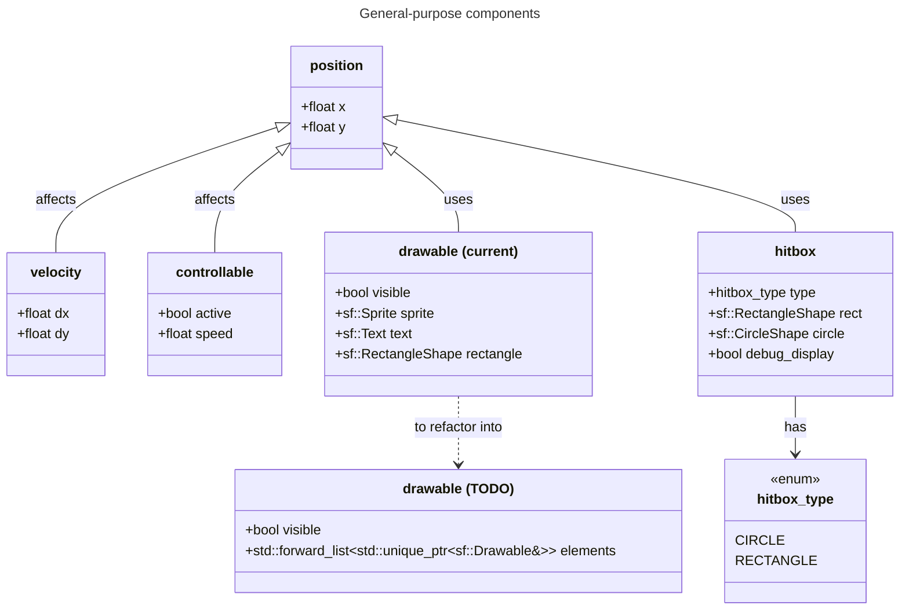
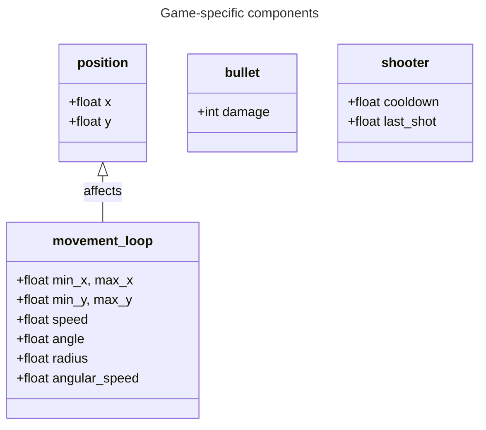
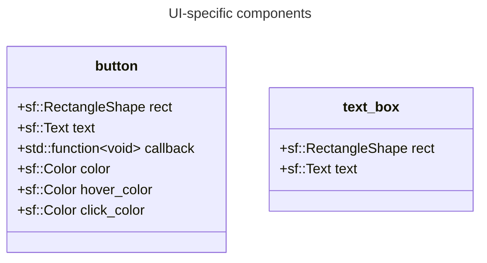
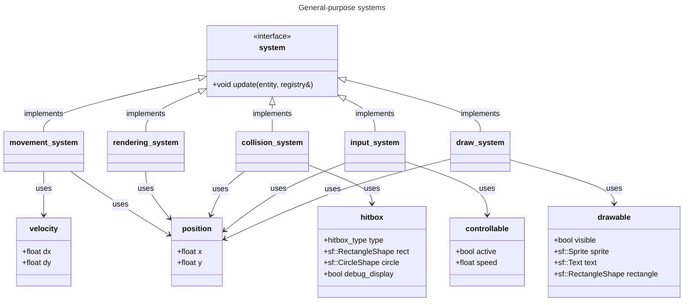
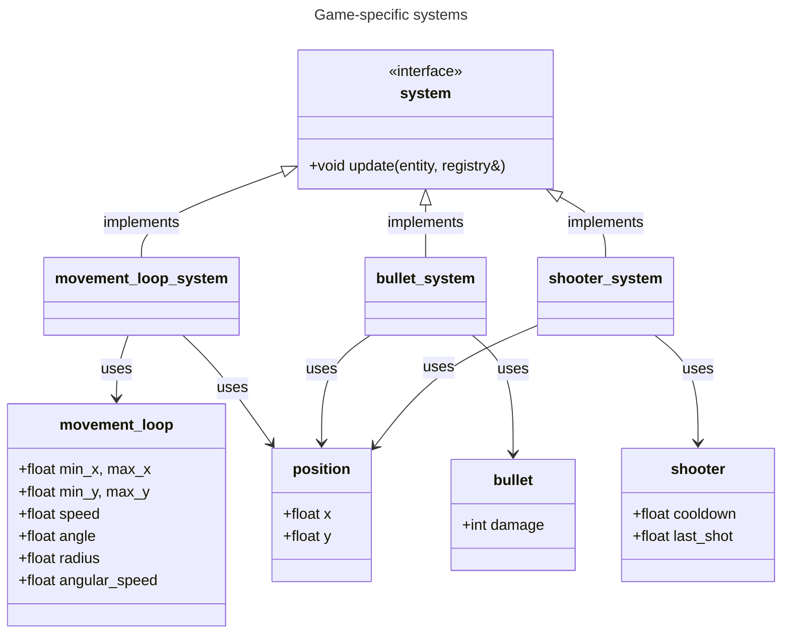
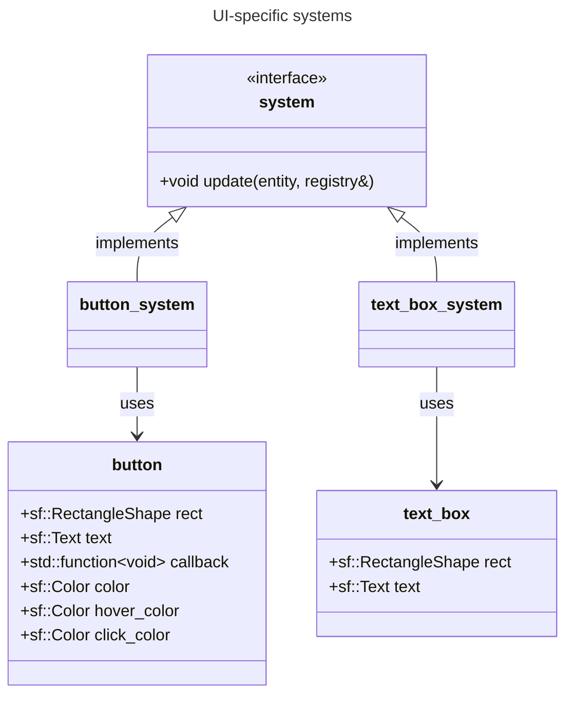

# ECS diagrams

## ECS Architecture

```mermaid
---
title: Entities and components
---
classDiagram
    registry --> entity
    registry --> components_array
    class registry {
        -std::unordered_map~std::type_index, components_array~ components
        -std::vector~bool~ entities
        -unsigned long next_entity_id
        +register_component<>()
        +get_components<>() std::vector~T&~
        +create_entity() entity
        +add_component<>(entity)
        +remove_component<>(entity)
        +kill_entity(entity)
    }
    class entity {
        -const unsigned long id
        -entity(unsigned long id)
        +operator()() unsigned long
    }
    class components_array {
        -std::vector~std::any~ components
        +get_component~T~(entity) T&
        +add_component(entity)
        +remove_component(entity)
    }
```

```mermaid
---
title: Systems (TODO)
---
classDiagram
    registry --> system
    class registry {
        -std::vector~system~ systems
        +register_system~Components...~(std::invocable~Components...~ auto)
        +register_system~Components...~(std::invocable~registry&, Components...~ auto)
        +run_systems()
    }
    class system {
        +const std::function~entity, registry&~ update
        +system~Components...~(std::invocable~Components...~ auto)
        +system~Components...~(std::invocable~registry&, Components...~ auto)
    }
```

## ECS components

```mermaid
---
title: General-purpose components
---
classDiagram
    position <|-- velocity : affects
    position <|-- controllable : affects
    position <|-- drawable_old : uses
    position <|-- hitbox : uses
    class controllable {
        +bool active
        +float speed
    }
    class position {
        +float x
        +float y
    }
    class velocity {
        +float dx
        +float dy
    }
    class drawable["drawable (TODO)"] {
        +bool visible
        +std::forward_list~std::unique_ptr~sf::Drawable&~~ elements
    }
    class drawable_old["drawable (current)"] {
        +bool visible
        +sf::Sprite sprite
        +sf::Text text
        +sf::RectangleShape rectangle
    }
    drawable_old ..> drawable : to refactor into
    class hitbox_type {
        CIRCLE
        RECTANGLE
    }
    <<enum>> hitbox_type
    hitbox --> hitbox_type : has
    class hitbox {
        +hitbox_type type
        +sf::RectangleShape rect
        +sf::CircleShape circle
        +bool debug_display
    }
```

```mermaid
---
title: Game-specific components
---
classDiagram
    position <|-- movement_loop : affects
    class position {
        +float x
        +float y
    }
    class movement_loop {
        +float min_x, max_x
        +float min_y, max_y
        +float speed
        +float angle
        +float radius
        +float angular_speed
    }
    class bullet {
        +int damage
    }
    class shooter {
        +float cooldown
        +float last_shot
    }
```

```mermaid
---
title: UI-specific components
---
classDiagram
    class button {
        +sf::RectangleShape rect
        +sf::Text text
        +std::function~void~ callback
        +sf::Color color
        +sf::Color hover_color
        +sf::Color click_color
    }
    class text_box {
        +sf::RectangleShape rect
        +sf::Text text
    }
```

## ECS systems

```mermaid
---
title: General-purpose systems
---
classDiagram
    class system {
        +void update(entity, registry&)
    }
    <<interface>> system
    system <|-- movement_system : implements
    system <|-- rendering_system : implements
    system <|-- collision_system : implements
    system <|-- input_system : implements
    system <|-- draw_system : implements
    class position {
        +float x
        +float y
    }
    class velocity {
        +float dx
        +float dy
    }
    class hitbox {
        +hitbox_type type
        +sf::RectangleShape rect
        +sf::CircleShape circle
        +bool debug_display
    }
    class controllable {
        +bool active
        +float speed
    }
    class drawable {
        +bool visible
        +sf::Sprite sprite
        +sf::Text text
        +sf::RectangleShape rectangle
    }
    movement_system --> velocity : uses
    movement_system --> position : uses
    rendering_system --> position : uses
    collision_system --> position : uses
    collision_system --> hitbox : uses
    input_system --> controllable : uses
    input_system --> position : uses
    draw_system --> drawable : uses
    draw_system --> position : uses
```

```mermaid
---
title: Game-specific systems
---
classDiagram
    class system {
        +void update(entity, registry&)
    }
    <<interface>> system
    system <|-- movement_loop_system : implements
    system <|-- bullet_system : implements
    system <|-- shooter_system : implements
    class position {
        +float x
        +float y
    }
    class movement_loop {
        +float min_x, max_x
        +float min_y, max_y
        +float speed
        +float angle
        +float radius
        +float angular_speed
    }
    class bullet {
        +int damage
    }
    class shooter {
        +float cooldown
        +float last_shot
    }
    movement_loop_system --> movement_loop : uses
    movement_loop_system --> position : uses
    bullet_system --> position : uses
    bullet_system --> bullet : uses
    shooter_system --> position : uses
    shooter_system --> shooter : uses
```

```mermaid
---
title: UI-specific systems
---
classDiagram
    class system {
        +void update(entity, registry&)
    }
    <<interface>> system
    system <|-- button_system : implements
    system <|-- text_box_system : implements
    class button {
        +sf::RectangleShape rect
        +sf::Text text
        +std::function~void~ callback
        +sf::Color color
        +sf::Color hover_color
        +sf::Color click_color
    }
    class text_box {
        +sf::RectangleShape rect
        +sf::Text text
    }
    button_system --> button : uses
    text_box_system --> text_box : uses
```
