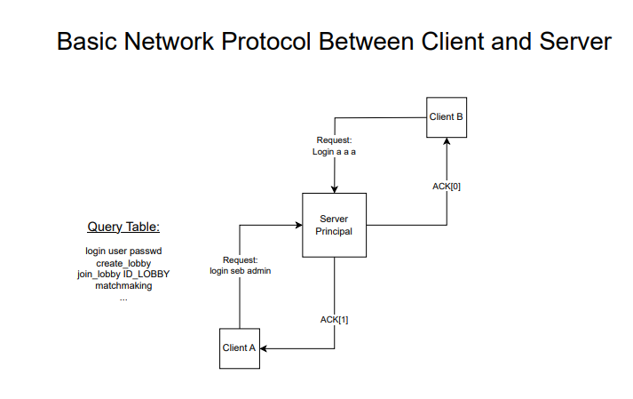
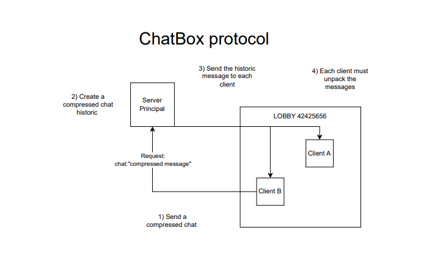
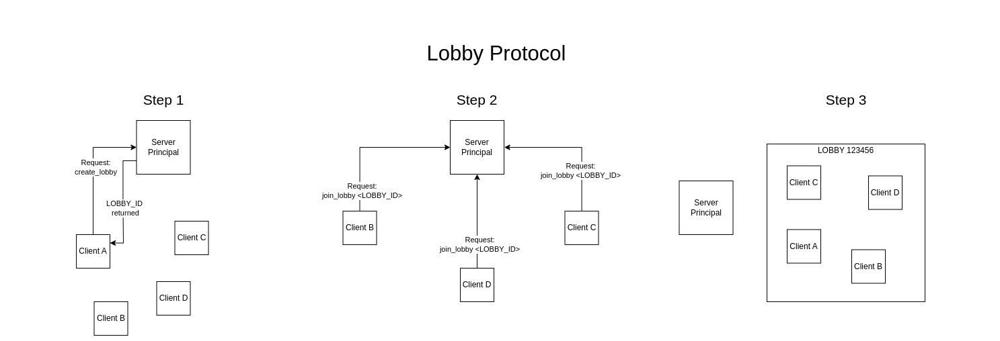
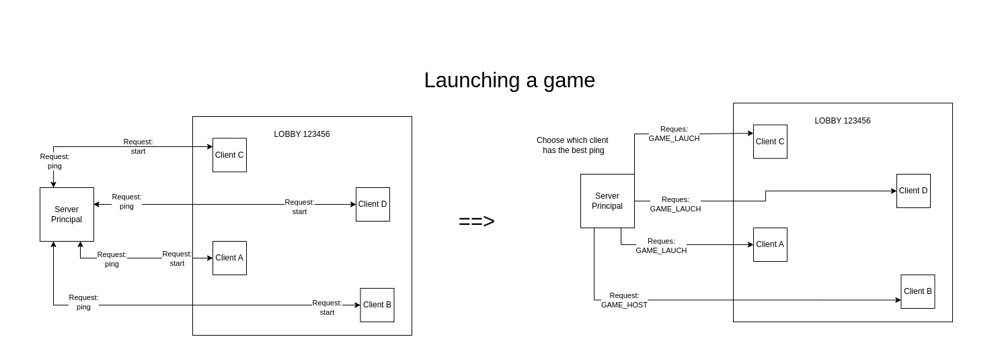

# R-Type

## Introduction Générale

Le projet R-Type est un jeu multijoueur en réseau inspiré du célèbre jeu de type shoot'em up. L'objectif principal de cette documentation est de détailler la conception et l'implémentation du système réseau utilisé dans le projet, en expliquant les choix technologiques, les mécanismes de communication, et la structure des données échangées. Cette documentation vise à fournir un aperçu complet du fonctionnement du réseau, de la création des paquets à leur transmission, tout en explorant les défis et les solutions mis en œuvre pour garantir une expérience de jeu fluide et réactive.

### Objectifs du Réseau

Le réseau doit répondre aux exigences suivantes :
- **Latence Faible** : Assurer des échanges de données rapides pour maintenir la réactivité du jeu.
- **Fiabilité** : Gérer efficacement la perte de paquets et garantir la continuité de la session de jeu.
- **Scalabilité** : Permettre à plusieurs joueurs de se connecter simultanément tout en préservant la performance.

Cette documentation se veut être une ressource complète pour les développeurs qui souhaitent comprendre le fonctionnement interne du réseau, les raisons des choix technologiques effectués et les bonnes pratiques adoptées pour la transmission de données dans le projet R-Type.

## Inspiration

Le développement du réseau du projet R-Type s'est fortement inspiré des principes établis par des jeux multijoueurs à succès, en particulier **Age of Empires**, reconnu pour sa solution ingénieuse basée sur un modèle **peer-to-peer**. L'architecture réseau d'Age of Empires a été conçue pour minimiser la latence et optimiser la synchronisation des joueurs, deux aspects critiques dans un jeu multijoueur en temps réel.

### Pourquoi s'inspirer du modèle Peer-to-Peer ?

Contrairement au modèle client-serveur classique, où un serveur central gère la majorité des calculs et des échanges de données, le modèle **peer-to-peer** offre plusieurs avantages :
- **Réduction de la Latence** : Les échanges directs entre les pairs réduisent la latence, améliorant ainsi la réactivité du jeu.
- **Répartition de la Charge** : Chaque joueur contribue à la transmission et au traitement des données, ce qui allège la charge sur un serveur unique et permet une meilleure scalabilité.
- **Robustesse en Cas de Panne** : Le réseau peut être conçu pour tolérer la déconnexion d'un pair sans interrompre la session des autres joueurs, rendant l'expérience plus résiliente.

### Influence d'Age of Empires

Le réseau d'**Age of Empires** repose sur une synchronisation déterministe où chaque pair exécute les mêmes actions de manière simultanée, assurant ainsi que tous les participants restent synchronisés. Ce concept est souvent appelé **simulation lockstep**. Dans le projet R-Type, des mécanismes similaires ont été envisagés pour garantir que chaque joueur possède une vue cohérente de l'état du jeu, tout en minimisant la latence perçue.

### Implémentation des Idées Inspirées

Pour le réseau de R-Type, l'implémentation s'appuie sur :
- **Protocole de Communication en Peer-to-Peer** : Adaptation des techniques de diffusion des paquets entre les pairs pour synchroniser l'état du jeu.
- **Synchronisation et Validation** : Chaque action initiée par un joueur est validée et propagée aux autres pairs pour assurer la cohérence du jeu.
- **Gestion de la Tolérance aux Pannes** : Des mécanismes de récupération et de réorganisation du réseau en cas de déconnexion d'un pair pour que la partie puisse continuer sans interruption.

Ces choix inspirés par **Age of Empires** permettent d'offrir une expérience multijoueur optimisée, répondant aux exigences de fluidité et de fiabilité d'un jeu en temps réel tel que R-Type.

## Choix Technologiques

L'intégration d'**Asio** et **Lz4** a été motivée par des études comparatives approfondies. Vous pouvez consulter les détails de ces études ci-dessous :

- [Étude comparative sur Asio](./Etudes/Etude%20Comparative%20Asio.pdf) : Analyse des alternatives pour la gestion des communications réseau.
- [Étude comparative sur Lz4](./Etudes/Etude%20Comparative%20Lib%20Compression.pdf) : Comparaison des algorithmes de compression et leur impact sur les performances réseau.

### Conclusion sur les Choix Technologiques

L'intégration d'**Asio** et **Lz4** dans le projet R-Type répond aux besoins critiques du réseau, à savoir la vitesse, la réactivité et l'efficacité. **Asio** offre une solution flexible et robuste pour gérer la communication réseau asynchrone, tandis que **Lz4** garantit que les données compressées peuvent être transmises rapidement sans compromettre la performance globale du système. Ces choix permettent de créer un réseau performant et résilient, capable de répondre aux exigences d'un jeu multijoueur compétitif et immersif.

### 1. Modèle de Communication

Le projet R-Type utilise une approche hybride où le **serveur principal** gère la coordination initiale des lobbys et des connexions, tandis que des éléments de communication **peer-to-peer** peuvent être intégrés pour des échanges optimisés entre les clients. Cela permet de bénéficier à la fois de la robustesse d'un serveur centralisé et de la rapidité des interactions directes entre les pairs.

#### Exemple de Lancement d'une Partie

Lorsqu'une partie est lancée :
- Chaque client envoie une requête de ping au serveur principal pour évaluer la latence.
- Le serveur choisit le client ayant le meilleur ping pour être l'hôte de la partie, garantissant ainsi une latence minimale pour la majorité des participants.
- Les requêtes `GAME_LAUNCH` sont envoyées aux autres clients pour synchroniser le début de la partie.

### 2. Protocole de Gestion des Lobbys

La gestion des lobbys se déroule en trois étapes principales :
1. **Création du Lobby** : Un client envoie une requête au serveur principal pour créer un lobby. Le serveur génère un `LOBBY_ID` unique qui est retourné au client initiateur.
2. **Rejoindre un Lobby** : Les autres clients utilisent le `LOBBY_ID` pour envoyer une requête `join_lobby` au serveur et rejoindre la même instance.
3. **Synchronisation des Joueurs** : Une fois tous les joueurs connectés, le lobby est synchronisé et prêt pour le lancement de la partie.

### 3. Protocole de Base entre le Client et le Serveur

Le protocole de base gère l'authentification et les interactions standard, telles que la création de lobbys et la mise à jour des états des joueurs. Chaque interaction entre le client et le serveur est confirmée par un accusé de réception (`ACK`).

### 4. Protocole de la Boîte de Discussion

Le jeu intègre un protocole de chat permettant aux joueurs de communiquer pendant les parties. Les messages sont compressés pour optimiser la bande passante et envoyés au serveur principal, qui les distribue ensuite à tous les clients du lobby. Chaque client décompresse et affiche les messages reçus.

#### Étapes du Protocole de Chat :
1. Le client envoie un message compressé au serveur principal.
2. Le serveur ajoute le message à l'historique du chat compressé.
3. Le serveur distribue le message compressé à tous les clients du lobby.
4. Chaque client décompresse le message et l'affiche dans l'interface utilisateur.

### Conclusion

Cette architecture réseau, qui combine des aspects client/serveur et peer-to-peer, permet de maintenir une expérience de jeu fluide et réactive. Le choix d'utiliser un serveur principal pour la coordination initiale et la gestion des lobbys, tout en permettant des communications directes entre pairs lorsque cela est possible, assure une latence réduite et une synchronisation optimale des joueurs.